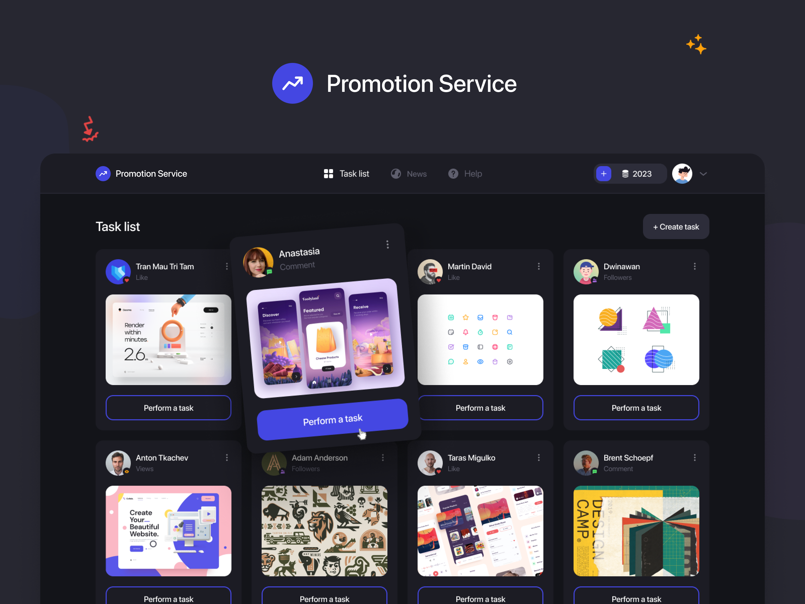

<!-- markdownlint-disable MD033 -->
<!-- markdownlint-disable MD041 -->

<div align="center">
  
  <p>
    <em>This project is solely for educational purposes.</em>
  </p>
</div>

## Table of Contents

- [Table of Contents](#table-of-contents)
- [Overview](#overview)
- [Built With](#built-with)
- [How To Start](#how-to-start)
- [Contact](#contact)

## Overview



Checkout the project design [here](https://www.figma.com/file/uMb2ZZesDdneYqGwHV3aGF/Promotion-Service).

## Built With

- [React.js](https://reactjs.org/)
- [TailwindCSS](https://tailwindcss.com/)

## How To Start

To clone and run this application, you'll need [Git](https://git-scm.com), [Node.js](https://nodejs.org/en/download/) and [Yarn](https://yarnpkg.com/getting-started/install) installed on your computer. From your command line:

```bash
# Clone this repository
$ git clone https://github.com/nathan22x3/react-promotion-service.git

# Navigate to project's directory
$ cd react-promotion-service

# Install dependencies
$ yarn

# Run the app
$ yarn start
```

## Contact

- GitHub [@nathan22x3](https://github.com/nathan22x3)
- GitHub [@bachletantien](https://github.com/bachletantien)
- GitHub [@ZweiWirlbert](https://github.com/ZweiWirlbert)
